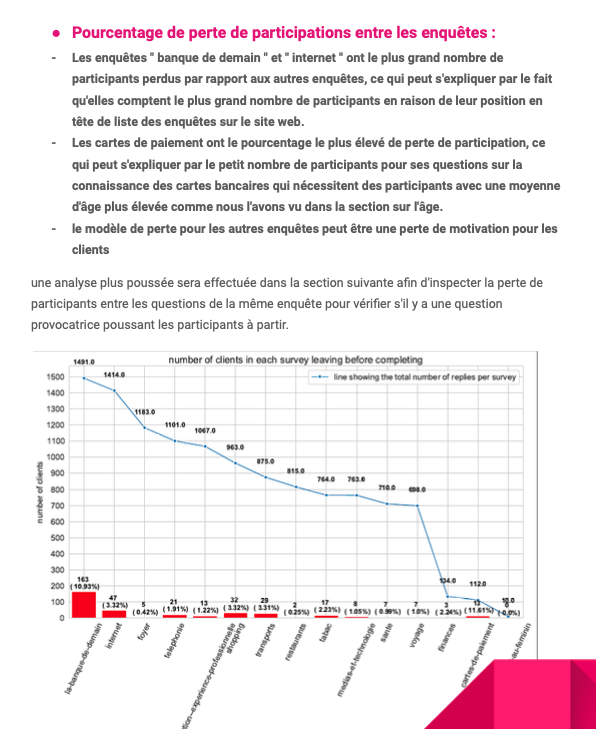
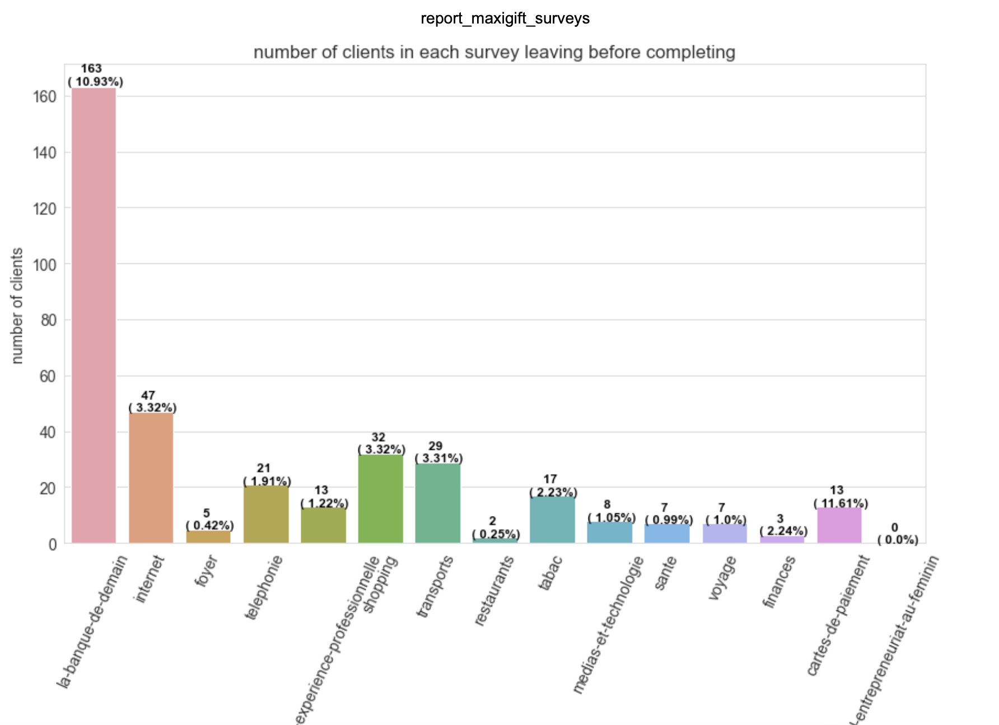
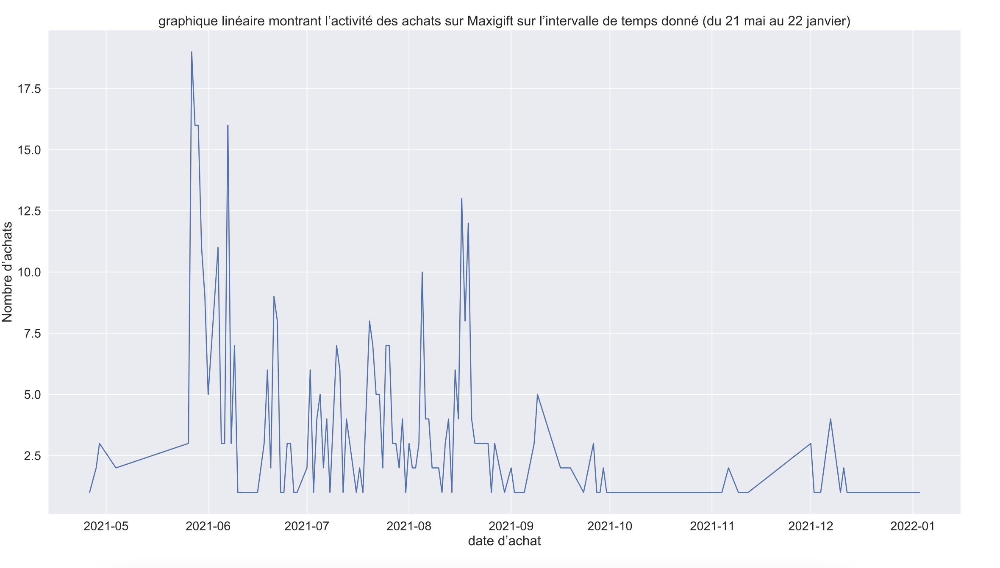

# Comment j'ai pu intégrer l'analyse de données avec Python dans mon agence digitale

L'objectif de cet article est de vous montrer en quelques lignes les enjeux de la science des données dans le domaine du marketing digital et de montrer subtilement de façon pratique comment cette science nous aide à améliorer l'expérience utilisateurs pour plus d'achat ou par plus de conversion.

{width=70%} ;

## Introduction

Avec le progrès des technologies numériques observé ces 10 dernières années,les stratégies marketing ont considérablement changées. Les marques, les entreprises grandes comme petites collectent une grande quantité de données sur diverses actions qui peuvent être les achats des clients, les préférences, l'activité liée a une action, des sondages ou avis, la démographie etc.

Le traitement de ces données par des spécialistes aident à comprendre le comportement de certains utilisateurs à différentes étapes, détecter des clients hésitants a finaliser leur commande, savoir si un produit crée de l'engouement ou d'autres comportements des internautes.
Rentrons sans plus tarder dans le vif du sujet. Je suis Franck Donald BASSA, developpeur Fullstack et Directeur technique de l' agence digitale [Aguima Web Agency](https://aguimawebagency.com/) depuis 2016 et elle est basée à Abidjan avec des filliales au Burkina Faso, En RDC et au Libéria et nous continuons à nous developper.

L'agence possède plusieurs produits propre à elle dont [MAXIGIFT](https://maxigift.net/) qui sera sujet de notre article.

## C'est quoi exactement MAXIGIFT ?

{width=50%}

MAXIGIFT est une plateforme de sondages rémunérés avec des points échangeables contre divers articles. En fait, l'utilisateur répond a des sondages sur diverses thématiques comme la Téléphonie, l'Internet, les cartes visas etc et après chaque sondage validé 
il recoit un nombre de point en fonction de la catégorie du sondage. 
Une boutique en ligne est disponible sur le site semblable a un site ecommerce avec un panier mais le moyen de paiement reste uniquement le nombre de point obtenu.

## Que donne l'usage de Google Analytics et Google Studio ?

Google Analytics et Google Studio sont des outils puissants qui permettent d’analyser un grand nombre d’informations relatives à l’activité de votre site internet. retenoons juste que Google Analytics extrait des données et Google studio se charge d'afficher ces données en figures graphiques lisibles. 
Ces solutions sont proposées par Google gratuitement sans nécessité de payer des droits d’entrée ou d’utilisation par la suite.

Google Analytics est utilisé par la majorité des administrateurs de sites internet désireux d’analyser leur trafic. Il est vite devenu indispensable lorsque l’on souhaite suivre de près ses campagnes de marketing digital et faire des reportings, permet aussi le calcul du retour sur investissement et bien d'autres.

De manière concrète cet outil nous permet sur [MAXIGIFT](https://maxigift.net/) de tracker les données des pages (Nombres de vues, Taux de rebond, nombres de clics etc).

## Ensuite nous avons connu Google Colab avec le langage python

Colab est le diminutif de colaboratory et comme son nom, il désigne un espace colaboratif de developpement de projets du machine learning et de l'analyse de données. En termes plus techniques, Colab, developpé avec le langage Python, est un service hébergé de notebooks Jupyter qui ne nécessite aucune configuration et permet d'accéder sans frais à des ressources informatiques, dont des GPU.

Google Colab est un outil très connu dans le monde de la data et beaucoup utilisé par les data scientist, les ingénieurs logiciels et autres acteurs de la data.

## Et à l’usage, que donne Google Colab pour mon site Maxigift?

{width=40%}

GOOGLE Colab avec le langage Python m'ont permis de ressortir un rapport avec des états et des recomandations à l'équipe du projet.
Ci dessous quelques points importants :

- Action sur de la base de données
  - Correction des valeurs nulles
  - Corrections des valeurs multiples (Champs select)
- Le schéma de perte entre les questions d'une même enquête
- Amélioration du taux de rebond sur les surveys
- Amélioration de l'expérience utilisateur

Le taux de rebond sur les enquêtes

{width=80%}

Analyse moyenne par genre

{width=80%}


Taux de rebond par enquête

{width=80%}

Rapport d'achat sur la boutique

{width=80%}


## Conclusion

Dans notre cas d'usage, le traitement de la base de données MYSQL du site avec Google Colab s'est avéré très bénéfique pour faire ressortir des conclusions plus précises
que les rapports de Google Anaytics. Notons aussi que nous n'avons pas eu à installer des tags analytics pour impacter le temps de chargement de nos pages.
Grace a l'analyse de données, les améliorations prochaine dans un second déploiement du site web seront l'amélioration de l'expérience utilisateur, 
amélioration des formulaires pour diminuer le taux de valeurs nulles et une automatisation de ce rapport avec extraction de la base de données automatique sur un drive google.
Tous ces points feront l'objet du prochain article.


<!-- ```python
# module foo.py

a = 42

def bar(x):
    print(x)
``` -->
