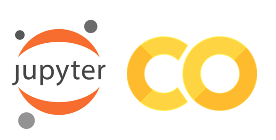

# Comment j'ai pu intégrer l'analyse de données avec Python dans mon agence digitale

L'objectif de cet article est de vous montrer en quelques lignes les enjeux de la science des données dans le domaine du marketing digital et de montrer subtilement de façon pratique comment cette science nous aide a parer certains problèmes.

{width=70%} ;

## Introduction

Avec le progrès des technologies numériques observé ces 10 dernières années,les stratégies marketing ont considérablement changées.Les marques, les entreprises grandes comme petites collectent une grande quantité de données sur diverses actions qui peuvent être les achats des clients, les préférences, l'activité liée a une action, des sondages ou avis, la démographie etc.

Le traitement de ces données par des spécialistes aident a comprendre le comportement de certains utilisateurs à différentes étapes, détecter des clients hésitants a finaliser leur commande, savoir si un produit crée de l'engouement et d'autres non.
Rentrons sans plus tarder dans le vif du sujet. Je suis Franck Donald BASSA, developpeur Fullstack et Directeur technique de l' agence digitale [Aguima Web Agency](https://aguimawebagency.com/) depuis 2016 et elle est basée à Abidjan avec des filliales au Burkina Faso, En RDC et au Libéria et nous continuons à nous developper.

L'agence possède plusieurs produits propre à elle dont [MAXIGIFT](https://maxigift.net/) qui sera sujet de notre article.

## C'est quoi exactement MAXIGIFT ?

{width=50%}

MAXIGIFT est une plateforme de sondages rémunérés avec des points échangeables contre divers articles. En fait, l'utilisateur répond a des sondages sur diverses thématiques comme la Téléphone, l'Internet, les cartes visas etc et après chaque sondage validé il recoit un nombre de point en fonction de la catégorie du sondage. Une boutique en ligne est disponible sur le site semblable a un site ecommerce avec un panier mais le moyen de paiement reste uniquement le nombre de point obtenu.

## Que donne l'usage des outils de Google Analytics ?

Google Analytics est un outil puissant qui permet d’analyser un grand nombre d’informations relatives à l’activité de votre site internet. Cette solution est proposée par Google gratuitement sans nécessité de payer des droits d’entrée ou d’utilisation par la suite.

Il est utilisée par la majorité des administrateurs de sites internet désireux d’analyser leur trafic. Il est vite devenu indispensable lorsque l’on souhaite suivre de près ses campagnes de marketing digital et faire des reportings, permet aussi le calcul du retour sur investissement et bien d'autres.

De manière concrète cet outil nous permet sur [MAXIGIFT](https://maxigift.net/) de tracker les données des pages (Nombres de vues, Taux de rebond, nombres de clics etc).

## Ensuite nous avons connu Google Colab avec le langage python

Colab est le diminutif de colaboratory et comme son nom, il désigne un espace ou l'on peut colaborer sur des projets du machine learning et de l'analyse de données. En termes plus techniques, Colab est un service hébergé de notebooks Jupyter qui ne nécessite aucune configuration et permet d'accéder sans frais à des ressources informatiques, dont des GPU.

Google Colab est un outil très connu dans le monde de la data et beaucoup utilisé par les data scientist, les ingénieurs logiciels et autres acteurs de la data.

## Et à l’usage, que donne l'utilisation de google collab pour mon site Maxigift?

{width=40%}


```python
# module foo.py

a = 42

def bar(x):
    print(x)
```
